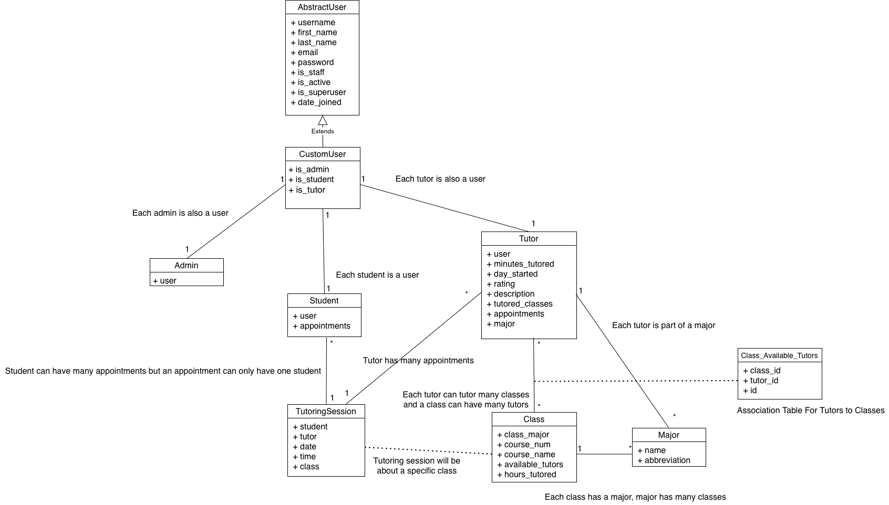

## VCEA Tutor App
--------
Prepared by: Team Tylenol

* `Jack Balster`,`WSU Team Tylenol`
* `Trenton Bergdahl`,`WSU Team Tylenol`
* `Cameron Caen`,`WSU Team Tylenol`
* `Adam Caudle`,`WSU Team Tylenol`
* `Matthew Pham`,`WSU Team Tylenol`
---

**Course** : CptS 322 - Software Engineering Principles I

**Instructor**: Sakire Arslan Ay

---

## Table of Contents
- [Document Revision History](#document-revision-history)
- [1. Introduction](#1-introduction)
- [2. Architectural and Component-level Design](#2architectural-and-component-level-design)
  - [2.1 System Structure](#21-system-structure)
  - [2.2 Subsystem Design](#22-subsystem-design)
    - [2.2.1 Model](#221-model)
    - [2.2.2 Controller](#222-controller)
    - [2.2.3 View and User Interface Design](#223-view-and-user-interface-design)
	- [Database Schema](#database-schema)
- [3. Progress Report](#3-progress-report)
- [4. Testing Plan](#4-testing-plan)
- [5. References](#5-references)
- [Appendix: Grading Rubric](#appendix-grading-rubric)

### Document Revision History

| Name | Date | Changes | Version |
| ------ | ------ | --------- | --------- |
|Revision 1 |2023-10-022 |Initial draft | 1.0        |
|Revision 2 | 2023-11-5 | Iteration 2 Update  |  2.0  |
|      |      |         |         |

# 1. Introduction

The purpose of making this design document is to record and document revisions, history, and design architecture of our VCEA tutor app. This is the first revision of this document.

The VCEA Tutor App is a web app designed using the DJANGO web framework with the goal of allowing students, tutors, and administrators to be able to efficiently and effectively schedule tutoring appointments and coordinate with students to help them receive the extra instruction that they need.

This document will cover the architecture, design, and the revision history of not only the app but also this document.

[Section II](#2-architectural-and-component-level-design) includes …

[Section III](#22-subsystem-design) includes …

# 2.  Architectural and Component-level Design
## 2.1 System Structure

The High-level architecture view of our app can be broken down similarly to the Model View Controller architecture (MVC) but because we are using django it is more apt to be called an App-view or DJANGO structure. While it follows similar design principles to MVC, the models and routes are separated from the view inside of the tutor project django apps. These elements are then separated and organized accordingly inside of the app.

 * 
 * Tutorapp controls the delegation into the View (Forms + Templates) , the Views/Routes and the model section which controls the models and Database Management.
 * The reason for this design is to eloquently and well separate the subsystems into their individual responsibilities for the software.

## 2.2 Subsystem Design
As we are using Django, the architectural design pattern we are using is the Django app structure. The key difference is that the MVT pattern separates the presentation layer more distinctly. Our Django app structure separates the students, tutors, and admins into their own apps. The calendar is then handled separately by another Django app. This separates the code and systems of the different major users and systems.

### 2.2.1 Apps -> Models

The Apps control the models which interact/create the database. Each app (for students, tutors, and admins) control the respective DB interactions and thus control the model for the system.

CustomUserManager - Model that represents all users of the app.
Attributes:
- email
- first_name
- last_name
- is_admin
- is_tutor
- is_student
- objects

CustomUser
- email
- first_name
- last_name
- is_admin
- is_tutor
- is_student
- objects

Admin
- user *One to One relationship with CustomUser model

Tutor 
- user *One to One relationship with CustomUser model
- minutes_tutored
- day_started
- rating
- description
- major *ForeignKey relationship with Major model

Student
- user *One to One relationship with CustomUser model

Course
- coursenum
- title
- major

Major
- name
- abbreviation

Class
- class_major *Foreign Key Relationship With Major model
- course_num
- course_name
- available_tutors *Many-to-Many relationship with Tutor model
- hours_tutored

TutoringSession
- student *ForeignKey relationship with Student model
- tutor *ForeignKey relationship with Tutor model
- date
- start_time
- end_time
- tutored_class *ForeignKey relationship with Class model

# Database Schema

### 2.2.2 Apps -> Views

The role of our apps and their view.py is to control the routes for url and template rendering. They act similar to the routes.py of flask, but each app within the django project has its own view.py which controls the routes. Each of the subsystems within this subsystem will be a django app. These systems are the tutor app, student app, admin app, and a scheduling Django app to handle the scheduling.

Tutor app:
The tutor app is responsible for handling views/routes relating to the tutor as a user class. All separate links and url/templates are directed to via the tutor app. Interacts with all other subsystems (student, admin, schedule. The Tutorapp depends on the scheduling app for scheduling appointments, the student app for associating with a tutoring appointment, and the admin app for tutor creation.

Student app:
The student app is responsible for handling views/routes relating to the student as a user class. All separate links and url/templates are directed to via the student app. Interacts with all other subsystems (tutor, admin, schedule). The student app depends on the tutor app for scheduling appointments. Students can be created without admin permission.
def register(request) Issues Post Request, Can accept get requests
def home(request) Accepts Post Requests

Admin app:
The Admin app is responsible for handling views/routes relating to the Admin as a user class. All separate links and url/templates are directed to via the Admin app. Interacts with all other subsystems (student, tutor, schedule. Does not depend on any other system, but has dependencies through creation and management of all other users I.E. Tutors and students.
def admin_view_deleteuser(request) Can issue Get and Post Requests
def admin_create_user(request) Can issue Post requests

List of all current paths/routes:
- path("", views.home, name="home"),
- path("register/", views.register, name="register"),
- path('login/', LoginView.as_view(template_name='login.html'), name='login'),
- path('logout/', LogoutView.as_view(next_page='login'), name='logout'),
- path('tutor/', views.tutor_view, name='tutor_view'),
- path('student/', views.student_view, name='student_view'),
- path('rate_tutor/<int:tutor_id>/', rate_tutor, name='rate_tutor'),
- path('schedule_session/<int:tutor_id>/', views.schedule_session, name='schedule_session'),
- path('administrator/', views.admin_view, name='admin_view'),
- path('administrator/createuser', views.admin_create_user, name='admin_create_user'),
- path('administrator/deleteuser/', views.admin_delete_user, name='admin_delete_user'),  
- path('administrator/printreports/', views.admin_view_reports, name='admin_view_reports'),
- path('administrator/createclass', views.admin_create_class, name='admin_create_class'),
- path('administrator/createmajor', views.admin_create_major, name='admin_create_major'),
- path('administrator/viewtutors', views.admin_view_tutors,name = 'admin_view_tutors'),
- path('administrator/edittutor/<int:tutor_id>', views.admin_edit_tutor_profile,name = 'admin_edit_tutor_profile'),
- path('administrator/classes_menu', views.classes_menu,name = 'classes_menu'),
- path('administrator/majors_menu', views.majors_menu,name = 'majors_menu'),
- path('administrator/delete_class/<int:class_id>', views.delete_class,name = 'delete_class'),
- path('administrator/delete_major/<int:major_id>', views.delete_major,name = 'delete_major'),

|   | Methods            | URL Path                    | Description                                      
|---|--------------------|----------------------------|--------------------------------------------------|
| 1 | Get                | ""                         | Basic Home Page                                  
| 2 | Get, Post          | "register/"                | Registration Page                               
| 3 | Post               | "login/"                   | Log in user                                      
| 4 | Post               | "logout/"                  | Log out current user                             
| 5 | Get, Post          | "student/"                 | Student Homepage                                
| 6 | Get, Post          | "tutor/"                   | Tutor Homepage                                  
| 7 | Get                | "administrator/"           | Administrator Homepage                          
| 8 | Get, Post          | "administrator/createuser" | Create User Page for Admin                      
| 9 | Get, Post          | "administrator/deleteuser" | Delete User Page for Admin                      
|10 | Get                | "administrator/printreports"| View Reports Page for Admin                     
|11 | Get, Post          | "administrator/createclass" | Create Class Page for Admin                     
|12 | Get, Post          | "administrator/createmajor" | Create Major Page for Admin                     
|13 | Get                | "administrator/viewtutors" | View Tutors Page for Admin                      
|14 | Get                | "administrator/edittutor/<int:tutor_id>" | Edit Tutor Profile Page for Admin    
|15 | Get                | "administrator/classes_menu" | View Classes Menu for Admin                  
|16 | Get                | "administrator/majors_menu"  | View Majors Menu for Admin                    
|17 | Get                | "administrator/delete_class/<int:class_id>" | Delete Class Page for Admin  
|18 | Get                | "administrator/delete_major/<int:major_id>" | Delete Major Page for Admin  
|19 | Get                | "rate_tutor/<int:tutor_id>/" | Rate Tutor Page for Students                  
|20 | Get, Post          | "schedule_session/<int:tutor_id>/" | Schedule Session Page for Students 
                       

### 2.2.3 View and User Interface Design

The role of our view is to properly display the directed information to the students, users, and admins using our tutor app. We plan to build the UI using WSU styling and separate based on the login roll. Currently we are doing everything in html and Django, but in the future we are looking at potentially using bootstrap or some other view framework).  

Current Templates
- adminPage.html  - Admin home page for viewing admin options
- base.html  - Base for housing sidebar and top banner/footer
- classes.html - page that admin sees showing all classes, can delete and add classes
- create_class.html - page that renders the create class form
- create_major.html - page that renders the create major form
- createuser.html  - page for admin to create a user
- deleteUser.html  - page for admin to delete a user
- edit_tutor.html - page for admin to edit a tutor's info
- generate_pdf.html - page for admin to generate PDF reports
- home.html  - home page for student user
- login.html  - login page for basic login
- majors.html - page that admin uses to see all majors, can delete and create majors
- rateTutor.html - page that allows student to rate tutor
- register.html  - page for registering a student
- studentPage.html  - student home page
- studentSchedule.html - student page for viewing a student's schedule
- tutorPage.html  - page for tutor for viewing tutor options
- tutors.html - admin page to view tutors and branch into editing different tutor fields

The view in MVT is responsible for handling the presentation layer of the application. It will receive and process user inputs (typically via URL routing), communicate with the model to fetch/manipulate data, decide which template to use for rendering the final output, and prepare the data to be displayed in the template.

- Home Page (Student)

	This page will display a default message to the user, as the student actions are all accessible from the side taskbar.

- Home Page (Tutor)

	This page will display a default message to the user, as the tutor actions are all accessible from the side taskbar.

- Home Page (Admin)
	
	This page will display the possible options for the admin functions. These options include creating and deleting users. These functions are represented by separate redirects to each form.

- Login Page
	
	This page will show the user fields for entering their email and password, as well as a submit button to log in. Additionally, it contains a link to register an account if one is not already made for the user, which redirects them to the register form. 

- Register Page

	This page will show the user the form for creating a new user for the portal. The fields in this form include first name, last name, email address, password, and confirm password. It will also contain a submit form that will take the user to the student home page, as the user can only create student profiles from this form.

- Scheduling Page

	This page will show the calendar that will be used to schedule appointments. It will display the separate slots in which you can schedule different tutoring sessions, as well as a calendar to contain all of this info. There will also be a submit button that will schedule the appointment and confirm it.

- Tutor Profile Page

	This page will display the tutor’s profile picture, name, email, major, description, preferred subjects, and available time slots.

- Admin User Creation Page

	This page will display a form used to create a new user. The form includes fields for first name, last name, email address, password, password confirmation, and a selection of which user type the new user will be. This also has a submit button to commit these changes to the database.

- Admin User Deletion Page

	This page will display a form used to delete users from the database. This page contains a selection of multiple roles to filter by, as well as a search function and a list of the users created. Each user has a delete button in order to commit the deletion of the user to the database.

- Admin Class Menu

	This page serves as the entry point to the class features. It allows the admin to view all classes currently in the database and provides links for the admin to easily create a new class and delete any classes listed.

- Admin Major Menu

	This page functions very similarly to the Admin Class Menu. It provides an entry point for the admin to begin using the major features of the app, including creation of a major, and deletion of the majors listed on the page.

- Admin Tutor Menu

	This page functions the same as the Admin Class Menu and Admin Tutor Menu, with some extra functionality. It lists all tutors, and some basic info about them. In every tutor entry, it provides links to manage tutor fields, such as profile features and shifts the tutor works.

- Admin Reports Menu

	This page allows the admin to print statistical reports reflecting data collected by the app, such as which classes get the most hours spent tutored, which tutors are the highest rated, and many more.

# 3. Progress Report 

In iteration 1, we implemented a basic framework for our application. We initialized the backend of the app, as well as an overall design for our frontend. We implemented functionality for register, login, and logout, as well as the sidebar for navigation. In the admin user type, you are able to filter users, as well as create and delete users of either student or tutor type. 

As of iteration 2, we have implemented every feature in the application except for appointment scheduling. Our database schema is fully implemented as our current plans for scheduling require. Our front end development follows a consistent pattern across all of the different user views, and is organized in a way that any user will be able to follow easily. We are currently on schedule and have even gotten an early start on scheduling. 

# 4.) Testing Plan

	The team plans to test the subsystem through a combination of automatic tests, edge case tests, and manual user testing to ensure the system is as bug free as possible and meets all usability standards.

 	Automatic testing will be performed through an organized testing folder inside the tutor app. This testing folder will have individual files meant to test the models and views seperately. The tests will reach out and test other apps so that testing can remain inside the main app subsystem for organizational purposes. The tests will be designed to test output, storage, and edge cases and utilized after major changes such that we can limit the number of human hours needed to test the system.

	Unit Tests:
	We are using the default django testing framework testcase which is important from django.tests. This will be used to write the automated testing which the team will use periodicly when neccecary to ensure the system is operating as expected.

	Function Tests:
	The testing system will also be used to verify that the system as a whole is operating as expected when performing tasks such as class cration, tutor assignment, etc. Any simple broad-scope function tests will be written into the testing system. Humans will also perform basic function tests to make sure that the web-page is behaving as expected.

	UI Testing:
	Manual human testing will be used to test the UI. They will only be used in a capacity of testing human interaction, as the underlying logic will be tested both manually and through use of written automated tests.

	Testing Progress:
	Currently a basic testing framework for models and views is implemented. The functions have not been written to test edge cases, only model creating and basic view testing has been implemented. This will be completed for iteration 3 to manually test edge cases and perform more full and cohesive tests of the system.

# 5. References
Homepage Voiland College of engineering and Architecture. (2023, October 9) https://vcea.wsu.edu